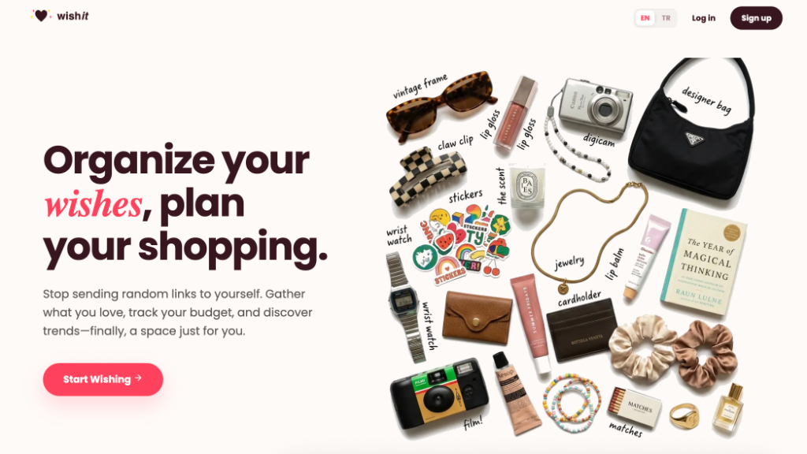
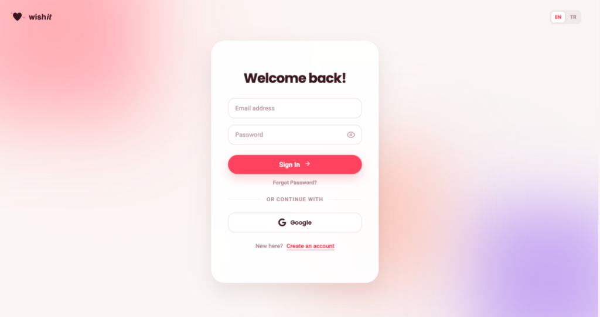
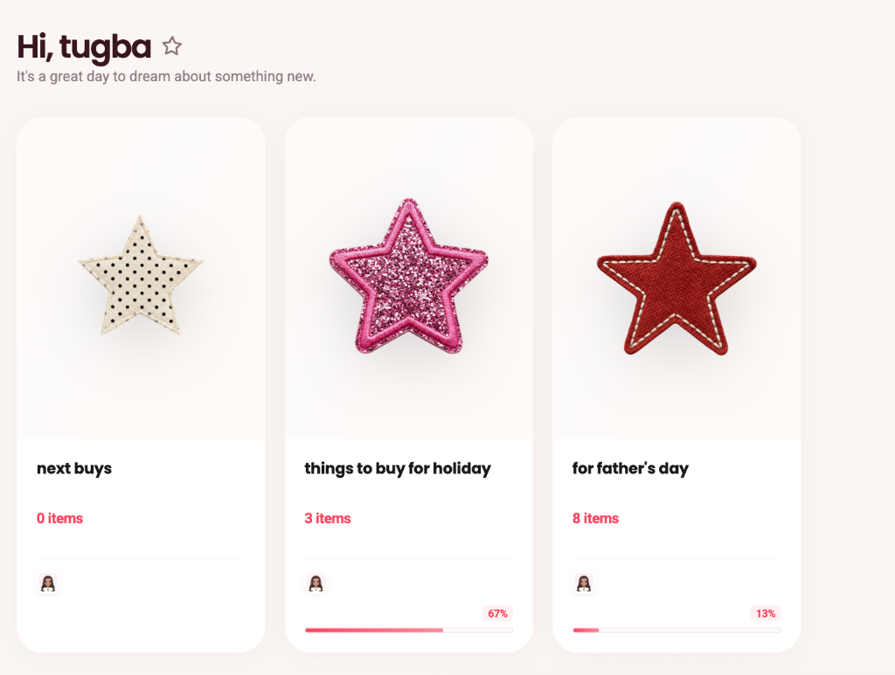
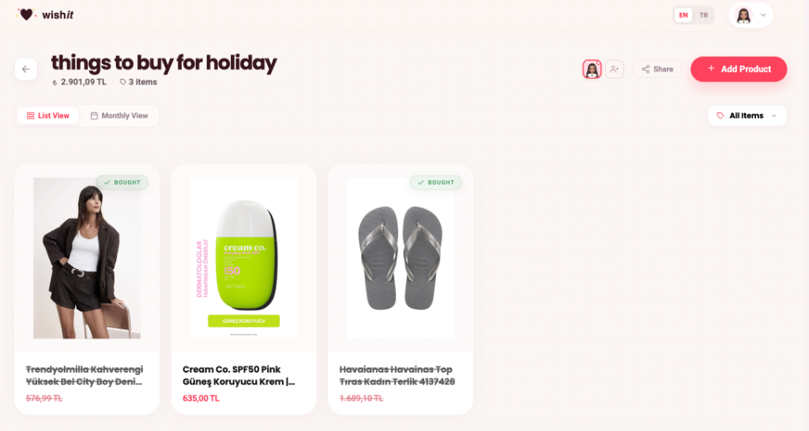

# Wishtra — Frontend

**Wishtra** is a modern wishlist management app where you can organize, categorize, and share your wishlists. Built with Next.js 15 and TypeScript.

🌐 **Live Demo**: [www.wishtra.com](https://www.wishtra.com)

---

## 📸 Screenshots

| Landing | Login |
|--------|-------|
|  |  |

| Dashboard | Wishlist Detail |
|-----------|----------------|
|  |  |

---

## ✨ Features

- 🔐 **Authentication** — Email/password login and Google OAuth
- 📋 **Wishlist Management** — Create, edit, and delete wishlists with custom icons
- 🛍️ **Product Management** — Add products with image, price, and URL
- 🤖 **Magic Fill** — Auto-fill product details by pasting a URL (Trendyol, Amazon, etc.)
- 🔗 **Sharing** — Share wishlists publicly with a unique link
- 👥 **Collaboration** — Invite collaborators to edit wishlists together
- 🌍 **i18n** — Turkish and English language support
- 📱 **Responsive** — Fully optimized for mobile and desktop

---

## 🛠️ Tech Stack

- **Framework**: Next.js 15 (App Router)
- **Language**: TypeScript
- **Styling**: SCSS Modules
- **Auth**: NextAuth.js + Google OAuth
- **State**: React Context API
- **Icons**: React Icons (Feather)

---

## 🚀 Getting Started

### Prerequisites
- Node.js 18+
- A running instance of the [Wishtra Backend](https://github.com/tugbayilmaz01/wishlist-backend)

### Installation

```bash
# Clone the repository
git clone https://github.com/tugbayilmaz01/wishlist-frontend.git
cd wishlist-frontend

# Install dependencies
npm install

# Set up environment variables
cp .env.example .env.local
# Fill in the required values in .env.local

# Start the development server
npm run dev
```

Open [http://localhost:3000](http://localhost:3000) in your browser.

### Environment Variables

```env
NEXT_PUBLIC_API_URL=http://localhost:5000
NEXTAUTH_URL=http://localhost:3000
NEXTAUTH_SECRET=your_secret_here
GOOGLE_CLIENT_ID=your_google_client_id
GOOGLE_CLIENT_SECRET=your_google_client_secret
```

---

## 📁 Project Structure

```
src/
├── app/              # Next.js App Router pages
│   ├── dashboard/    # Main dashboard (wishlists)
│   ├── landing/      # Public landing page
│   ├── login/        # Auth pages
│   └── shared/       # Public shared wishlist view
├── components/       # Reusable UI components
├── context/          # React Context (Auth, Language)
├── translations/     # i18n strings (TR/EN)
├── types/            # TypeScript type definitions
└── utils/            # Helper functions
```

---

## 🔗 Related

- **Backend**: [wishlist-backend](https://github.com/tugbayilmaz01/wishlist-backend) — .NET 9 REST API

---

## 📄 License

MIT
